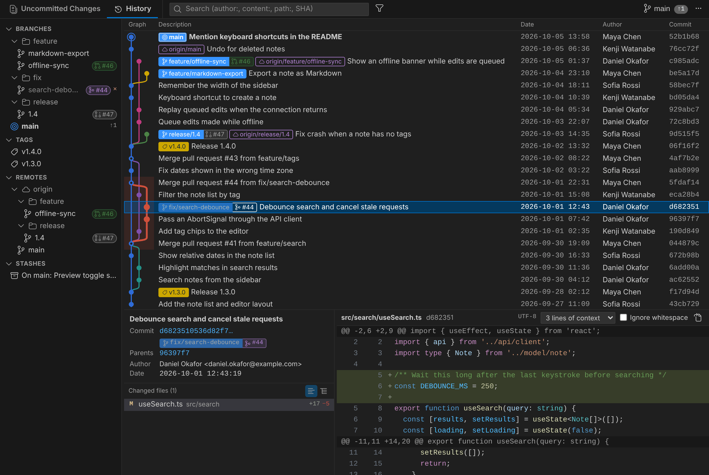

# Twigline

A Git client inside VS Code: branches, the commit graph, file status with line-level staging, and diffs in one panel.

[日本語](./README.ja.md)

- Opens each repository in its own editor tab with "Uncommitted Changes | History" tabs, the history graph with branch lists, and details / diffs side by side
- Actions sit where they apply: pull, push, merge and rebase for the current branch on the branch name in the tab row (clicking the ahead / behind counts also pushes / pulls); stash and discard inside the "Uncommitted Changes" tab; fetch, push branches, branch, tag and settings under "…" at the right end of the tab row
- Stage / unstage / discard by file, hunk or line in the "Uncommitted Changes" tab
- Right-click opens VS Code's own context menu
- Actions with options open a dialog that previews the git command to be run; push, pull, merge, rebase, reset and branch deletion also show what the operation would do (ahead / behind, conflicts, force push, commits that would be lost) before it runs
- English and Japanese UI; Japanese file names and Shift_JIS / EUC-JP files
- Syntax highlighting in diffs, using the grammars installed in VS Code and the colors of the current color theme

## Installation

- VS Code: search for "Twigline" in the Extensions view (VS Code Marketplace)
- Cursor and other VS Code-compatible editors: search for "Twigline" in the Extensions view (Open VSX Registry)

## Requirements

- VS Code 1.95 or later, or Cursor based on VS Code 1.95 or later
- Git (Twigline uses the git that VS Code's built-in Git extension uses; set `twigline.gitPath` to use a different one)
- A trusted workspace (Twigline does not run in Restricted Mode or in virtual workspaces)

## Usage

| Where | How |
| --- | --- |
| Command Palette | `Twigline: Open Repository in Twigline` (`twigline.open`) |
| Source Control view title | The Twigline icon |
| Activity Bar | "Twigline" → Repositories |
| Status Bar | Click `main ↑1 ↓2` |
| Right-click in the Explorer or on an editor tab | "File History" |

Keys in the panel: `Ctrl+Shift+1 / 2` (Uncommitted Changes / History), `Ctrl+F` (search history), `Ctrl+Shift+R` (refresh), `Ctrl+Enter` (commit),
`↑ ↓ PageUp PageDown Home End` in lists, `Space` on the selected row of the file list or diff (toggle staging), `Shift+F10` (context menu).
Fetch / pull / push are available as commands, so you can bind them to keys of your choice.

When the panel opens, it shows the "Uncommitted Changes" tab if there are uncommitted changes, and the "History" tab otherwise.
History has a single search box; a prefix selects the kind of search.

| Input | Result |
| --- | --- |
| `login` | Search commit messages |
| `author:alice` | Search by author |
| `content:validate(` | Search changes (`git log -G`) |
| `path:src/auth` | History of that path (with the graph) |
| `a1c93e0` (7 or more hex digits) / `sha:feature/login` | Go to that commit |

The filter button next to the search box chooses which branches, remote branches and stashes to show. The order is set with `twigline.history.order`.

File history has a "Follow renames" toggle. When on, history continues past renames and commits are drawn as dots only; when off, the graph lines are drawn.

## Pull requests

If the remote is on GitHub (including GitHub Enterprise Server) or Bitbucket Cloud (bitbucket.org), pull requests for branches are shown with a `#12` badge
(in the branch and remote branch lists, on branch badges in history and details, on the current branch in the tab row, and in the list of the Delete Branch dialog).
Click the badge, or "Open Pull Request" in a branch's context menu, to open it in the browser. "Create Pull Request" is not offered for branches with an open pull request.

| Badge | State |
| --- | --- |
| Green / `git-pull-request` | Open |
| Gray / `git-pull-request-draft` | Draft |
| Purple / `git-merge` | Merged (branch name dimmed) |
| Red / `git-pull-request-closed` | Closed without merging (including declined or superseded on Bitbucket; branch name dimmed) |

- Local branches are matched by the name of their upstream branch (merged pull requests are still shown after the upstream branch is deleted on the remote).
  If several pull requests share a branch name, an open one wins, otherwise the most recently updated one. Pull requests from forks are told apart by the remote's owner.
- Public repositories are read without signing in (from the most recently updated pull requests: 100 on GitHub, 50 on Bitbucket; both limited to 60 requests per hour).
- For a private GitHub repository, click "Sign in to GitHub to show pull requests" at the end of the branch list and sign in with your GitHub account in VS Code (scope `repo`).
  Once signed in, older pull requests of local branches are also found by name. For GitHub Enterprise Server, set `github-enterprise.uri` to the server URL.
- For a private Bitbucket repository, click "Connect to Bitbucket to show pull requests" and enter your Atlassian account email and an API token (scope `read:pullrequest:bitbucket`).
  The token is stored in VS Code's secret storage, and older pull requests of local branches are also found by name.
  Remove the saved token with the command `Twigline: Disconnect from Bitbucket (Remove Saved API Token)`. Bitbucket Data Center (self-hosted) is not supported.
- Results are reused for a while (30 seconds when signed in, 2 minutes otherwise) and re-read after fetch / push, when you return to the panel, and every 3 minutes while it is visible.
  `Ctrl+Shift+R` (refresh) re-reads them immediately.
- To turn this off, disable `twigline.pullRequests.enabled` (Twigline then stops querying GitHub and Bitbucket).

## Contributing

See [CONTRIBUTING.md](./CONTRIBUTING.md) for how to build, test and release.

## License

[MIT](./LICENSE)
